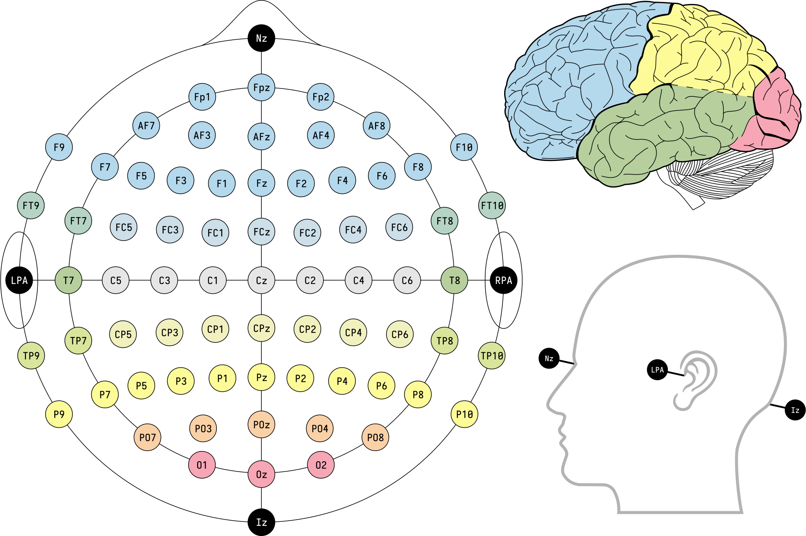
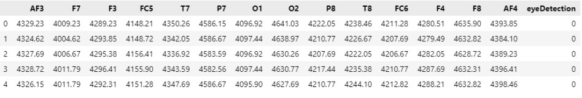
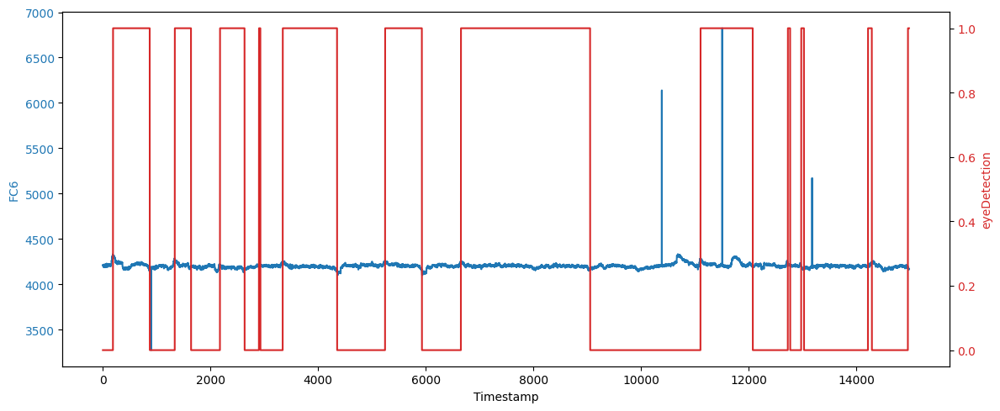
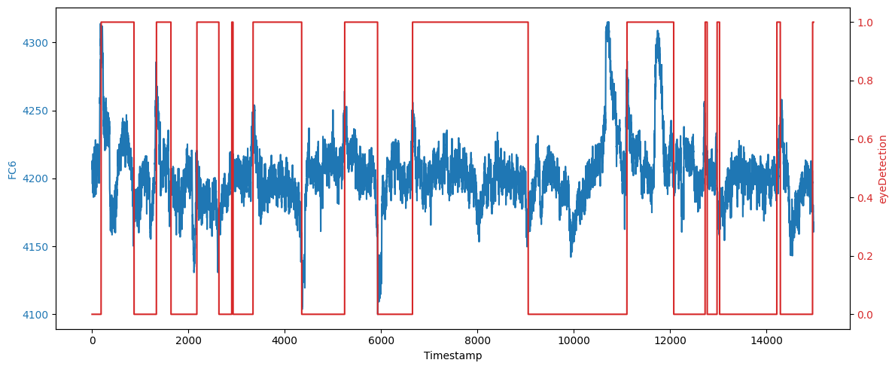
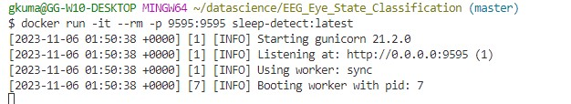
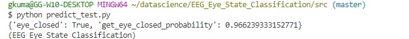

# Eye State Classification from EEG #

Project for MLZoomcamp 2023

## Problem

Electroencephalography, commonly known as EEG, is a technique used to capture the brain's electrical activity. It involves the use of wearable headgear fitted with nonintrusive electrodes that rest on the scalp. This project aims to classify the signals into eye-closed vs eye-open state.

By Laurens R. Krol - Own work, CC0, https://commons.wikimedia.org/w/index.php?curid=96859272

## Dataset

This is a multivariate, sequential, time series dataset that can be used for supervised binary classification task.

This dataset was procured from openml and has an ID-1471.

[OPENML download link](https://www.openml.org/data/download/1587924/phplE7q6h)

Information below is from UCI Repository:

Author: Oliver Roesler

Source: UCI, Baden-Wuerttemberg, Cooperative State University (DHBW), Stuttgart, Germany

All data is from one continuous EEG measurement with the Emotiv EEG Neuroheadset. The duration of the measurement was 117 seconds. The eye state was detected via a camera during the EEG measurement and added later manually to the file after analyzing the video frames. '1' indicates the **eye-closed** and '0' the **eye-open** state. All values are in chronological order with the first measured value at the top of the data.

The features correspond to 14 EEG measurements from the headset, originally labeled AF3, F7, F3, FC5, T7, P, O1, O2, P8, T8, FC6, F4, F8, AF4, in that order.

Roesler,Oliver. (2013). EEG Eye State. UCI Machine Learning Repository. https://doi.org/10.24432/C57G7J.

- Sample Data

## Methodology

Steps 1-6 can be seen in EEG_Eye_State_EDA.ipynb notebook

Step 1: EDA

Figure below shows the original feature FC6 with eyeDetection = 1 when the eyes are closed.
There is some noise in the data as we can see from the spikes.

Step 2: Data Cleaning

All features are cleaned using Z-scores with any value exceeding 3 standard deviations removed and filled with a linear interpolation of the data.
Sample feature FC6 after cleaning is shown below:

Step 3: Baseline comparison of models

Multiple models are compared to see which one to select. XGBoost seems to do better and it was selected for further training as seen in train.py.

Step 4: Model Selection

XGBoost model was selected and further hyperparameter optimization was done to get the best parameters that gave the best f1 score.

Step 5: Final Model Training

A final XGBoost model was trained. Getting a very accurate model was not the main objective for this project.

Step 6: Model Saving

Model is saved in models folder after final training with the best estimator from hyperparameter tuning.

Step 7: Flask web-service for the model deployment

Predict.py is a flask app that opens port and can be tested.

When called, it calls predict that loads the json and runs model inference and provides an output as a json

Predict_test.py can be called to run the features through this call. The port numbers should be the same.

Step 8: Containerizing the app with Docker

See Dockerfile for how it was setup.

Main docker commands used:

docker build -t sleep-detect:latest .

docker run -it --rm -p 9696:9696  sleep-detect:latest

Results from running the app:

